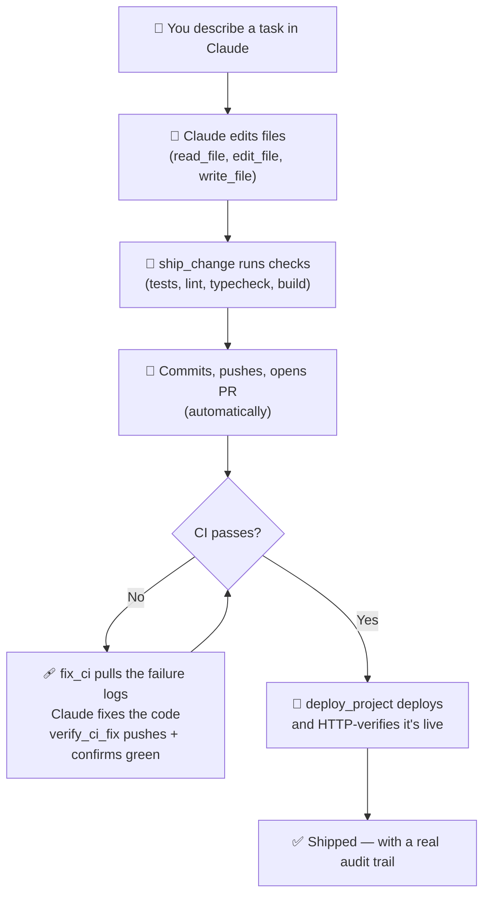

# Causly Server

[](./LICENSE)
[](https://github.com/KNIHAL/causly-server/actions/workflows/ci.yml)
[](./CONTRIBUTING.md)

**The MCP (Model Context Protocol) server that turns Claude into a full end-to-end product builder** — build, host, deploy, containerize, and manage a real project from a single chat, without switching between a dozen dashboards.

Runs entirely on your own machine, connects directly to Claude Desktop (or any MCP client), and talks straight to your filesystem, databases, containers, infrastructure, and every service in your stack. No hosted middleman — your code, your credentials, and your data never pass through anyone else's server.

<!-- Demo GIF / screenshot goes here -->

## Why Causly Server

Building and shipping a real product means constantly switching context — write code, open a terminal, check Docker, log into Notion, check Sentry, SSH into a database, run Terraform, check Slack. Causly Server puts all of that inside one conversation with Claude: you describe what you want, Claude does the actual work — end to end — and reports back with a verified result, not just a guess.

It's built for solo founders and small teams who don't have a dedicated DevOps person or a platform team — the AI *is* your platform team, running locally, under guardrails you control.

## Causly Server vs. Zapier / Composio / generic integration platforms

| | Causly Server | Zapier / Composio-style platforms |
|---|---|---|
| **Setup** | Fill in a token, the workflow is already built | You wire up the automation yourself, every time |
| **Where your data lives** | Local-first — never leaves your machine | Cloud-hosted — your data and credentials pass through their servers |
| **Depth** | Expert-level, product-lifecycle-aware tools (build → deploy → manage) | Generic, one-action-at-a-time integrations |
| **Limits** | None — it's free and open-source (MIT) | Usage tiers, task limits, seat-based pricing |
| **Safety** | Built-in permission levels + approval gates on risky actions | Varies by platform, rarely this granular |

## What it can do

Think of an actual product's lifecycle — this covers it, end to end, from inside one Claude conversation:

| Stage | What's covered |
|---|---|
| **Code** | Read, write, edit, move, and search files and directories |
| **Version control** | Full git lifecycle — branch, commit, merge, stash, tag, diff — plus the complete GitHub PR and Actions/CI lifecycle |
| **Databases** | Generic Postgres and MySQL (query, schema inspection) plus Supabase |
| **Containers** | Docker — build, run, manage, inspect, compose up/down — works with Docker Desktop or WSL-only setups |
| **Infrastructure** | Terraform — full lifecycle (plan/apply/destroy), state management, and a CI/CD hook that posts plan summaries to your PRs |
| **Secrets** | A built-in local encrypted secrets manager — no external vault service required |
| **Monitoring** | Sentry — list, search, and triage errors from inside the same conversation |
| **Docs & knowledge** | Notion — pages, databases, blocks, comments |
| **Communication** | Slack and Gmail — read, search, send, reply |
| **Deployment** | Vercel — deploy, verify, roll back, check logs and health |
| **Project intelligence** | Auto-detects your stack and runs the right test/lint/build commands — no guessing |

181 tools in total, across every one of those stages — but the point isn't the count, it's that one Claude conversation can now carry a project from an empty repo to a running, monitored, deployed product.

## The AI-employee layer: workflow tools

Individual tools are the primitives. These chain them into real, verified outcomes:

- **`ship_change`** — inspects your changes, branches, runs checks, commits, pushes, opens the PR
- **`fix_ci` + `verify_ci_fix`** — finds a failing GitHub Actions run, pulls the real logs, and once you've fixed the code, commits/pushes/polls until CI is actually green
- **`deploy_project`** — checks project health, runs tests + build, deploys, polls, and HTTP-verifies the live URL is actually up — not just "deployment triggered"



A more detailed, per-category architecture breakdown lives in [`docs/`](./docs).

## Security model

This server can genuinely change your machine, your infrastructure, and your production systems — so every tool call goes through a classification and audit layer before it runs:

- **Permission levels** — every tool is classified `READ` / `LOW` / `MEDIUM` / `HIGH` / `DESTRUCTIVE`. `HIGH` and `DESTRUCTIVE` actions (deploys, merges, `run_command`, deletes, raw SQL, `terraform apply/destroy`, `docker rm`) are blocked unless the caller explicitly passes `confirm: true` — this is the approval gate.
- **Secret redaction** — tokens, passwords, API keys, and similar fields are stripped before anything is written to a log, regardless of where they appear in the input.
- **Command risk classification** — beyond hard-blocked destructive patterns (drive wipes, `format`, `shutdown`), commands are scanned for elevated-risk signals (force-push, `DROP TABLE`, curl-pipe-bash, `sudo`) and surfaced for auditability, not just silently allowed.
- **Path security** — writes and deletes are blocked outright if the target path falls inside a protected system directory.
- **Local secrets, encrypted at rest** — the built-in secrets manager uses AES-256-GCM with a key you control; nothing touches an external vault service by default.
- **Structured audit log** — every tool call is appended to `logs/activity.log` as one JSON object per line: timestamp, operation ID, risk level, status, redacted input, and duration.

Fork it, self-host it, adapt it — the classification and approval layer travels with the code no matter where you run it.

## Requirements

- Node.js 18+
- Claude Desktop (or any MCP-compatible client)
- Optional, only if you're using the relevant tools: Docker, Terraform CLI, a Postgres/MySQL instance

## Setup

1. Clone this repo anywhere on your machine, e.g. `D:\causly-server`
2. Install dependencies:
   ```bash
   npm install
   ```
3. Copy `.env.example` to `.env` and fill in tokens for whichever services you plan to use — skip anything you don't need, add more anytime:
   ```bash
   cp .env.example .env
   ```
4. Point Claude Desktop at this server — either run the helper, which finds your Claude Desktop config automatically and adds the entry:
   ```bash
   npm run setup
   ```
   or do it by hand, adding this to your Claude Desktop config (`%APPDATA%\Claude\claude_desktop_config.json` on Windows):
   ```json
   {
     "mcpServers": {
       "causly-server": {
         "command": "node",
         "args": ["D:\\causly-server\\index.js"]
       }
     }
   }
   ```
5. Restart Claude Desktop. Claude now has direct access to every tool above.

## Known limitations

- **`vercel_create_deployment` / `deploy_project`** require the Vercel project to already be git-linked; they don't create that link for you.
- **`supabase_run_sql`** uses Supabase's Management API — some personal access tokens restrict this by default. If you hit a `403`, check your token's SQL execution permission.
- **`slack_search_messages`** requires a Slack **user token** (`search:read` scope) — bot tokens (`xoxb-...`) cannot search. All other Slack tools work fine with a bot token.
- **Gmail tools** use OAuth2 (client ID/secret + refresh token), not a simple API key — see `.env.example` for the setup flow via Google Cloud Console + OAuth Playground.
- **`docker_push`** needs real registry authentication configured on the host.
- **Sentry `resolve_issue` / `ignore_issue` / `add_comment`** need an auth token with `event:write` scope, in addition to the read scopes used by the rest of the Sentry tools.

## Project structure

```
causly-server/
├── index.js                # Server entry point, tool/resource/prompt registration
├── setup.js                 # Configures your Claude Desktop config automatically
├── package.json
├── .env                     # Your local tokens (never committed)
├── .env.example
├── BUILD_LOG.md              # What was built, in what order, and why
├── ROADMAP.md                 # What's planned next
├── CONTRIBUTING.md
├── CODE_OF_CONDUCT.md
├── CHANGELOG.md
├── docs/                     # Detailed technical docs (GitHub Pages)
├── .github/
│   ├── workflows/ci.yml
│   ├── ISSUE_TEMPLATE/
│   └── PULL_REQUEST_TEMPLATE.md
├── tools/
│   ├── fileOps.js           # File read/write/edit/move/copy
│   ├── directoryOps.js      # Directory listing, tree, search
│   ├── gitOps.js            # Git operations via simple-git
│   ├── commandOps.js        # Shell command execution
│   ├── githubOps.js         # GitHub REST API — repos, issues, PRs, Actions
│   ├── vercelOps.js         # Vercel REST API — projects, deployments
│   ├── supabaseOps.js       # Supabase Management API
│   ├── slackOps.js          # Slack Web API — channels, messages, threads
│   ├── gmailOps.js          # Gmail API (OAuth2) — search, read, send, reply, forward
│   ├── notionOps.js         # Notion API — pages, databases, blocks, comments
│   ├── terraformOps.js      # Terraform CLI wrapper — full lifecycle + state + CI hook
│   ├── dockerOps.js         # Docker CLI wrapper — cross-platform (direct or via WSL)
│   ├── dbOps.js             # Generic Postgres/MySQL query tools
│   ├── secretsOps.js        # Local AES-256-GCM encrypted secrets manager
│   ├── sentryOps.js         # Sentry API — issues, projects, stats
│   ├── projectOps.js        # Stack detection, test/lint/build runners
│   ├── workflowOps.js       # ship_change, fix_ci, verify_ci_fix, deploy_project
│   ├── security.js          # Redaction, permission levels, risk classification
│   ├── envLoader.js         # Dependency-free .env parser
│   └── logger.js            # Structured JSONL activity logging
└── logs/
    └── activity.log          # Auto-generated
```

## Want something custom built on this?

If you need a custom MCP server, a specific integration, or a related service built for your own product or team — reach out: **nihal@causly.in**

## Roadmap

See [ROADMAP.md](./ROADMAP.md) for what's planned next.

## Contributing

See [CONTRIBUTING.md](./CONTRIBUTING.md) for how to add a new tool module and the manual testing checklist. Please also read the [Code of Conduct](./CODE_OF_CONDUCT.md).

## Changelog

See [CHANGELOG.md](./CHANGELOG.md) for release history.

## Build history

See [BUILD_LOG.md](./BUILD_LOG.md) for a full account of what was built, in what order, and the bugs found and fixed along the way.

## License

[MIT](./LICENSE) — free to use, modify, and distribute, including commercially.
