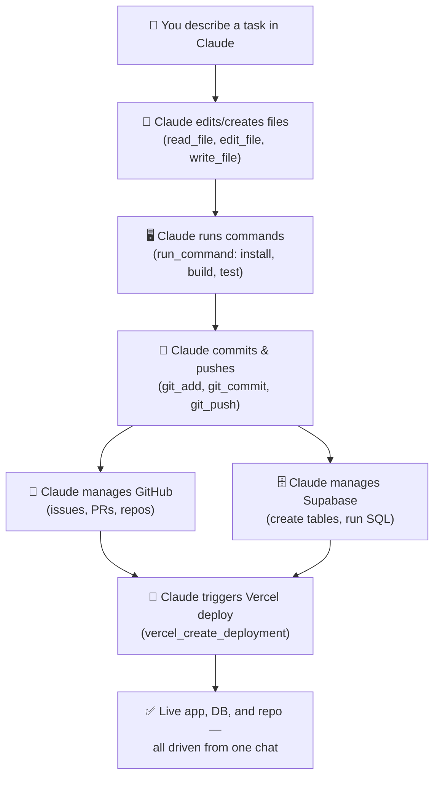

# Causly Server

[](./LICENSE)
[](https://github.com/KNIHAL/causly-server/actions/workflows/ci.yml)
[](./CONTRIBUTING.md)

A custom MCP (Model Context Protocol) server that gives Claude full, direct control over your local machine and your core dev stack — filesystem, git, shell, GitHub, Vercel, and Supabase — all from a single self-hosted server you fully own.

Built for [Causly](#) as the core dev-automation layer behind our AI agency workflow, and open-sourced so other builders/founders can run their own instance.

## Why this exists

Claude is great at writing code, but by default it can't touch your files, run your commands, or talk to the services you actually ship with. Most solutions bolt on a separate hosted connector for every service — which adds latency, extra hops, and confusion for the model. Causly Server takes the opposite approach: **one server, one process, full control**, running entirely on your own machine. Every tool call is logged locally, every credential lives in your own `.env`, and nothing routes through a third party.

## Features

**File operations**
`read_file` · `read_multiple_files` · `create_file` · `write_file` · `edit_file` · `delete_file` · `move_file` · `copy_file` · `get_file_info`

**Directory operations**
`list_directory` · `directory_tree` · `create_directory` · `delete_directory` · `search_files`

**Git operations**
`git_init` · `git_status` · `git_add` · `git_commit` · `git_push` · `git_pull` · `git_log` · `git_diff` · `git_branch`

**Shell execution**
`run_command` — run any shell command (npm install, tests, builds, etc.) in a given directory. A short list of destructive patterns (drive wipes, `format`, `shutdown`) is hard-blocked; everything else runs with full permissions, since this is designed for trusted, single-user local use.

**GitHub**
`github_get_authenticated_user` · `github_create_repo` · `github_delete_repo` · `github_list_repos` · `github_create_issue` · `github_list_issues` · `github_create_pull_request` · `github_list_pull_requests` · `github_add_comment`

**Vercel**
`vercel_get_authenticated_user` · `vercel_list_projects` · `vercel_get_project` · `vercel_list_deployments` · `vercel_get_deployment` · `vercel_create_deployment` · `vercel_delete_project`

**Supabase**
`supabase_list_organizations` · `supabase_list_projects` · `supabase_get_project` · `supabase_create_project` · `supabase_delete_project` · `supabase_run_sql`

**Logging**
Every tool call — success or failure — is appended to `logs/activity.log` for auditability.

## The workflow this enables



In short: you talk, Claude codes, tests, commits, provisions the database, opens the PR, and ships the deploy — all through one local server, without you ever leaving the conversation.

## Requirements

- Node.js 18+
- Claude Desktop

## Setup

1. Clone this repo anywhere on your machine, e.g. `D:\causly-server`
2. Install dependencies:
   ```bash
   npm install
   ```
3. Run the setup wizard — it asks for each token (skip any you don't need) and automatically writes your `.env` file **and** updates your Claude Desktop config:
   ```bash
   npm run setup
   ```
   Prefer to do it by hand? Copy `.env.example` to `.env` and fill in what you need, then add the `mcpServers` entry to your Claude Desktop config yourself (`%APPDATA%\Claude\claude_desktop_config.json` on Windows):
   ```json
   {
     "mcpServers": {
       "causly-server": {
         "command": "node",
         "args": ["D:\\causly-server\\index.js"]
       }
     }
   }
   ```
4. Restart Claude Desktop. Claude will now have direct access to every tool above.

## Known limitations

- **`supabase_run_sql`** uses Supabase's Management API, which restricts direct SQL execution for personal access tokens by default (`403: insufficient privileges`). Workaround: connect directly via Postgres (using the project's database password) or use the project's own PostgREST API instead — not yet implemented here, tracked as a future improvement.
- **Vercel preview deployments** created via `vercel_create_deployment` may be served behind Vercel's own Deployment Protection (SSO wall) rather than your app directly, depending on your account's settings. Production deployments/custom domains are unaffected.

## Security note

This server runs with **full, unrestricted access** to whatever machine it's installed on — there are no path restrictions, and API tokens are used with whatever scope you grant them. That's an intentional design choice for personal/trusted single-user setups, not a general-purpose deployment. If you plan to expose this to other users or run it in a shared environment, add path allow-listing and stricter permission scoping before doing so.

## Project structure

```
causly-server/
├── index.js              # Server entry point, tool registration
├── setup.js               # Interactive setup wizard (npm run setup)
├── package.json
├── .env                   # Your local tokens (never committed)
├── .env.example           # Template of tokens you can configure
├── CONTRIBUTING.md
├── CHANGELOG.md
├── .github/
│   ├── workflows/ci.yml    # Syntax check + boot check on push/PR
│   ├── ISSUE_TEMPLATE/
│   └── PULL_REQUEST_TEMPLATE.md
├── tools/
│   ├── fileOps.js         # File read/write/edit/move/copy
│   ├── directoryOps.js    # Directory listing, tree, search
│   ├── gitOps.js          # Git operations via simple-git
│   ├── commandOps.js      # Shell command execution
│   ├── githubOps.js       # GitHub REST API
│   ├── vercelOps.js       # Vercel REST API
│   ├── supabaseOps.js     # Supabase Management API
│   ├── envLoader.js       # Dependency-free .env parser
│   └── logger.js          # Activity logging
└── logs/
    └── activity.log        # Auto-generated
```

## Roadmap

Planned additions, following the same self-contained pattern: Slack, Gmail, Figma.

## Contributing

See [CONTRIBUTING.md](./CONTRIBUTING.md) for how to add a new tool module and the manual testing checklist.

## Changelog

See [CHANGELOG.md](./CHANGELOG.md) for release history.

## License

MIT — see [LICENSE](./LICENSE) for details.
