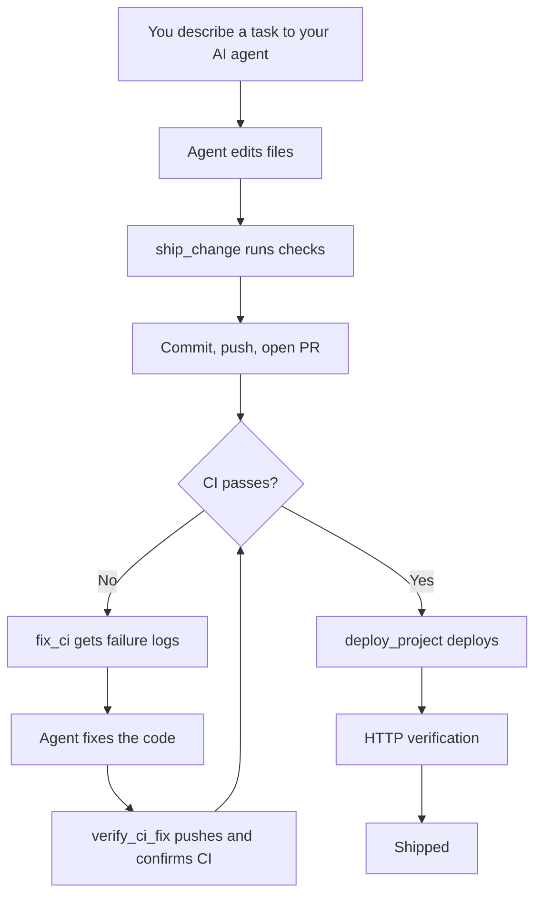

# Causly Server

[](./LICENSE)
[](https://github.com/KNIHAL/causly-server/actions/workflows/ci.yml)
[](./CONTRIBUTING.md)

**An open-source MCP server that gives MCP-compatible AI agents direct access to your development environment and the tools around it.**

Causly Server connects an AI agent to your filesystem, Git, GitHub, databases, Docker, Terraform, Vercel, Supabase, monitoring, communication tools, and more — with built-in permissions, approval gates, secret redaction, and activity logging.

Run it locally, connect it to your MCP-compatible client, and let your agent work across your project and infrastructure from a single conversation.

## See It In Action


[Working Demo](https://github.com/user-attachments/assets/7f4f33e8-2cd4-4c99-ada0-35653bbaa4c4)

[Screenshort]


## Why Causly Server

Building and shipping a real product usually means moving between code editors, terminals, GitHub, databases, containers, cloud dashboards, monitoring tools, and communication platforms.

Causly Server brings these capabilities into the MCP layer so an AI agent can work across the same environment instead of being limited to generating text or isolated actions.

The goal is simple: give an agent the tools it needs to **inspect, build, change, verify, and deploy real projects** while keeping execution local and under controls you can inspect.

## What It Can Do

Causly Server currently provides tools across the main stages of a software project's lifecycle.

| Area                     | Capabilities                                                               |
| ------------------------ | -------------------------------------------------------------------------- |
| **Filesystem**           | Read, write, edit, move, copy, search files and directories                |
| **Git**                  | Branch, commit, merge, stash, tag, diff, and other Git operations          |
| **GitHub**               | Repositories, issues, pull requests, Actions and CI workflows              |
| **Databases**            | PostgreSQL and MySQL queries and schema inspection                         |
| **Supabase**             | Supabase Management API operations                                         |
| **Docker**               | Build, run, manage, inspect, and compose containers                        |
| **Terraform**            | Plan, apply, destroy, state management, and CI/CD integration              |
| **Vercel**               | Deployments, verification, rollbacks, logs, and health checks              |
| **Sentry**               | Search, inspect, and triage issues                                         |
| **Notion**               | Pages, databases, blocks, and comments                                     |
| **Slack**                | Channels, messages, and threads                                            |
| **Gmail**                | Search, read, send, reply, and forward                                     |
| **Secrets**              | Local encrypted secrets storage                                            |
| **Project intelligence** | Detects the project stack and runs relevant test, lint, and build commands |

The current server contains **181 tools across 16 categories**.

The goal isn't the number of tools. It's giving an AI agent a connected set of capabilities that can work together across an actual project lifecycle.

## Workflow Tools

Individual tools are the building blocks. Causly Server also includes higher-level workflow tools that combine them into verified outcomes.

### `ship_change`

Inspects the current changes, creates a branch, runs project checks, commits the changes, pushes the branch, and opens a pull request.

### `fix_ci`

Finds a failing GitHub Actions run and retrieves the real failure information so the agent can work from the actual CI output.

### `verify_ci_fix`

After the code is fixed, commits and pushes the changes, polls the workflow, and verifies that CI is actually green.

### `deploy_project`

Checks project health, runs tests and build checks, deploys the project, polls the deployment, and HTTP-verifies that the deployed URL is actually responding.



A more detailed, per-category architecture breakdown lives in [docs/](https://github.com/KNIHAL/causly-server/tree/master/website/docs)

## Security

Causly Server can perform actions that affect your machine, repositories, infrastructure, and production systems. Security controls are therefore part of the server itself.

### Permission levels

Every tool is classified as:

`READ` / `LOW` / `MEDIUM` / `HIGH` / `DESTRUCTIVE`

`HIGH` and `DESTRUCTIVE` operations require explicit `confirm: true` before execution. This includes actions such as deploys, merges, command execution, deletes, raw SQL, Terraform apply/destroy, and Docker removal.

### Secret redaction

Tokens, passwords, API keys, and similar sensitive fields are redacted before being written to logs.

### Command risk classification

Commands are checked for dangerous patterns such as drive wipes, formatting, and shutdown operations. Elevated-risk signals such as force-pushes, `DROP TABLE`, `curl | bash`, and `sudo` are also classified and surfaced for auditability.

### Path protection

Writes and deletes are blocked when the target path falls inside a protected system directory.

### Local encrypted secrets

The built-in secrets manager stores secrets locally using **AES-256-GCM** with a key you control. It does not require an external vault service.

### Activity log

Tool calls are recorded in `logs/activity.log` as structured JSONL entries containing the timestamp, operation ID, risk level, status, redacted input, and duration.

### Optional BoundaryAttest receipts

When explicitly enabled, Causly emits separate `server_attested` Interop Profile v0.2 receipts for `ship_change`, `verify_ci_fix`, and `deploy_project`.

Interop Profile v0.2 uses RFC 8785/JCS for language-neutral canonicalization. BoundaryAttest v0.1 remains a legacy profile.

This evidence layer does **not** replace or change Causly's approval or security behavior.

See [docs/boundaryattest.md](https://github.com/KNIHAL/causly-server/tree/master/website/docs/tools/boundaryattest.md)

## Getting Started

The current setup flow is:

**Fork → Clone → Install → Configure → Run → Connect your MCP client**

### 1. Fork

Fork this repository to your own GitHub account.

### 2. Clone

Clone your fork locally:

```bash
git clone https://github.com/KNIHAL/causly-server.git
cd causly-server
```

### 3. Install dependencies

```bash
npm install
```

### 4. Configure your environment

Copy the example environment file:

```bash
cp .env.example .env
```

Open `.env` and add the API keys and credentials for the services you want to use.

You only need to configure the integrations you plan to use.

### 5. Connect Causly Server to your MCP client

Add Causly Server to your MCP client's configuration using the local `index.js` entry point.

For example, in Claude Desktop:

**Windows:** `%APPDATA%\Claude\claude_desktop_config.json`

```json
{
  "mcpServers": {
    "causly-server": {
      "command": "node",
      "args": ["D:\\causly-server\\index.js"]
    }
  }
}
```

Use the equivalent MCP server configuration for your MCP-compatible client.

### 6. Restart your MCP client

After saving the configuration, restart your MCP client.

Causly Server will then be available to the client with the tools enabled by your configuration.

> `setup.js` is currently kept as a helper/demo for configuring Claude Desktop. It is not the project's package installation mechanism.


## Known Limitations

* `vercel_create_deployment` and `deploy_project` require the Vercel project to already be Git-linked.
* `supabase_run_sql` uses the Supabase Management API. Some personal access tokens may restrict SQL execution and return `403`.
* `slack_search_messages` requires a Slack user token with the `search:read` scope. Other Slack tools can work with a bot token.
* Gmail tools use OAuth2 with a client ID, client secret, and refresh token rather than a simple API key.
* `docker_push` requires registry authentication to already be configured on the host.
* Sentry `resolve_issue`, `ignore_issue`, and `add_comment` require an authentication token with the `event:write` scope.

## Project Structure

```text
causly-server/
├── index.js                # Server entry point, tool/resource/prompt registration
├── setup.js                 # Helper/demo for configuring your Claude Desktop config automatically
├── package.json
├── .env                     # Your local tokens (never committed)
├── .env.example
├── BUILD_LOG.md              # What was built, in what order, and why
├── ROADMAP.md                 # What's planned next
├── CONTRIBUTING.md
├── CODE_OF_CONDUCT.md
├── CHANGELOG.md
├── docs/                     # Detailed technical docs (GitHub Pages)
├── .github/
│   ├── workflows/ci.yml
│   ├── ISSUE_TEMPLATE/
│   └── PULL_REQUEST_TEMPLATE.md
├── tools/
│   ├── fileOps.js           # File read/write/edit/move/copy
│   ├── directoryOps.js      # Directory listing, tree, search
│   ├── gitOps.js            # Git operations via simple-git
│   ├── commandOps.js        # Shell command execution
│   ├── githubOps.js         # GitHub REST API — repos, issues, PRs, Actions
│   ├── vercelOps.js         # Vercel REST API — projects, deployments
│   ├── supabaseOps.js       # Supabase Management API
│   ├── slackOps.js          # Slack Web API — channels, messages, threads
│   ├── gmailOps.js          # Gmail API (OAuth2) — search, read, send, reply, forward
│   ├── notionOps.js         # Notion API — pages, databases, blocks, comments
│   ├── terraformOps.js      # Terraform CLI wrapper — full lifecycle + state + CI hook
│   ├── dockerOps.js         # Docker CLI wrapper — cross-platform (direct or via WSL)
│   ├── dbOps.js             # Generic Postgres/MySQL query tools
│   ├── secretsOps.js        # Local AES-256-GCM encrypted secrets manager
│   ├── sentryOps.js         # Sentry API — issues, projects, stats
│   ├── projectOps.js        # Stack detection, test/lint/build runners
│   ├── workflowOps.js       # ship_change, fix_ci, verify_ci_fix, deploy_project
│   ├── boundaryAttest.js    # Optional signed workflow-receipt POC
│   ├── security.js          # Redaction, permission levels, risk classification
│   ├── envLoader.js         # Dependency-free .env parser
│   └── logger.js            # Structured JSONL activity logging
└── logs/
    └── activity.log          # Auto-generated
```

## Roadmap

See [ROADMAP.md](./ROADMAP.md) for what's planned next.

## Contributing

See [CONTRIBUTING.md](./CONTRIBUTING.md) for how to add a new tool module and the manual testing checklist. Please also read the [Code of Conduct](./CODE_OF_CONDUCT.md).

## Changelog

See [CHANGELOG.md](./CHANGELOG.md) for release history.

## Build history

See [BUILD_LOG.md](./BUILD_LOG.md) for a full account of what was built, in what order, and the bugs found and fixed along the way.

## License

[MIT](./LICENSE) — free to use, modify, and distribute, including commercially.

## Want something custom built on this?

If you need a custom MCP server, a specific integration, or a related service built for your own product or team — reach out: **nihal@causly.in**

## Causly Hosted

Don't want to run Causly Server on your own machine?

Causly Hosted is a managed version of Causly Server currently in development. Join the early-access waitlist to be notified when it's ready.

[→ Join the Causly Hosted waitlist](https://tally.so/r/NpZkpW)


