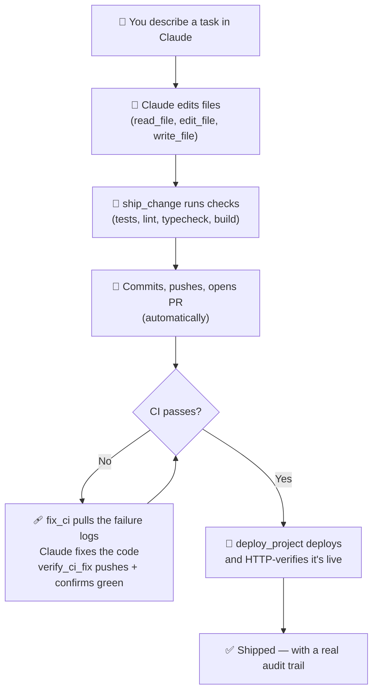

# Causly Server

[](./LICENSE)
[](https://github.com/KNIHAL/causly-server/actions/workflows/ci.yml)
[](./CONTRIBUTING.md)

An MCP (Model Context Protocol) server that turns Claude into an **autonomous AI DevOps operator** for solo founders and micro-agencies — not just a set of tools, but a controlled AI employee that can understand a project, execute real work, verify the result, and report back, while staying inside guardrails you define.

Runs entirely on your own machine, integrates with Claude Desktop, and talks directly to your filesystem, git, shell, GitHub, Vercel, and Supabase. No hosted middleman, no third-party server sees your code or your credentials.

## Why this exists

Most AI coding tools stop at "write the code." Causly Server goes further: it gives Claude the primitives to actually **ship** — branch, test, commit, push, open the PR, diagnose a failing CI run, fix it, and deploy — and the judgment layer (permission levels, approval gates, audit logs) to do all of that safely on a machine you fully control.

The target user is a solo founder or a small agency who doesn't have a DevOps team: you describe the task, Causly Server does the mechanical work end-to-end, and asks for your explicit confirmation before anything risky.

## What it can do

**94 tools across 10 categories**, plus 3 MCP resources and 4 guided MCP prompts.

| Category | Tools | Examples |
|---|---|---|
| Files | 9 | read, write, edit, move, copy, delete |
| Directory | 5 | list, tree, search, create, delete |
| Git | 20 | full lifecycle — branch, merge, reset, stash, tag, diff, remote |
| Shell | 1 | `run_command` — arbitrary shell execution, risk-classified |
| GitHub | 27 | full PR lifecycle + Actions/CI (list runs, pull logs, rerun) |
| Vercel | 11 | projects, deployments, logs, health checks |
| Supabase | 6 | projects, raw SQL execution |
| Slack | 8 | channels, messages, threads, search |
| Gmail | 8 | search, read, send, reply, forward |
| Project Intelligence | 7 | auto-detect stack, run tests/lint/typecheck/build |

**Workflow tools** — the actual "AI employee" layer, chaining the primitives above into one call:
- `ship_change` — inspects your changes, branches, runs checks, commits, pushes, opens the PR
- `fix_ci` + `verify_ci_fix` — finds a failing GitHub Actions run, pulls the logs, and after you fix the code, commits/pushes/polls until CI is green
- `deploy_project` — checks project health, runs tests + build, deploys, polls, and HTTP-verifies the live URL is actually healthy — not just "deployment triggered"

**MCP Resources** — direct context reads without a tool call round-trip: `causly://project/{path}/health`, `/info`, `/git`

**MCP Prompts** — reusable guided workflows: `ship-feature`, `fix-ci`, `deploy-project`, `review-changes`

## Security model

This server can genuinely change your machine and your production systems, so every tool call goes through a classification and audit layer before it runs:

- **Permission levels** — every tool is classified `READ` / `LOW` / `MEDIUM` / `HIGH` / `DESTRUCTIVE`. `HIGH` and `DESTRUCTIVE` actions (deploys, merges, `run_command`, deletes, raw SQL) are blocked unless the caller explicitly passes `confirm: true` — this is the approval gate.
- **Secret redaction** — tokens, passwords, API keys, and similar fields are stripped before anything is written to a log, regardless of where they appear in the input.
- **Command risk classification** — beyond the hard-blocked destructive patterns (drive wipes, `format`, `shutdown`), commands are scanned for elevated-risk signals (force-push, `DROP TABLE`, curl-pipe-bash, `sudo`) and the result is surfaced for auditability, not just silently allowed.
- **Path security** — writes and deletes are blocked outright if the target path falls inside a protected system directory (`C:\Windows`, `Program Files`, `ProgramData`, etc.).
- **Structured audit log** — every tool call is appended to `logs/activity.log` as one JSON object per line: timestamp, operation ID, risk level, status, redacted input, and duration.

Built and tuned for running on your own machine, under your own credentials. Fork it, self-host it, adapt it — the classification and approval layer above travels with the code no matter where you run it.

## The workflow this enables



## Requirements

- Node.js 18+
- Claude Desktop (MCP client)

## Setup

1. Clone this repo anywhere on your machine, e.g. `D:\causly-server`
2. Install dependencies:
   ```bash
   npm install
   ```
3. Run the setup wizard — it asks for each token (skip any you don't need) and writes your `.env` **and** updates your Claude Desktop config automatically:
   ```bash
   npm run setup
   ```
   Or do it by hand: copy `.env.example` to `.env`, fill in what you need, then add this to your Claude Desktop config (`%APPDATA%\Claude\claude_desktop_config.json` on Windows):
   ```json
   {
     "mcpServers": {
       "causly-server": {
         "command": "node",
         "args": ["D:\\causly-server\\index.js"]
       }
     }
   }
   ```
4. Restart Claude Desktop. Claude now has direct access to every tool above.

## Known limitations

- **`vercel_create_deployment` / `deploy_project`** require the Vercel project to already be git-linked; they don't create that link for you.
- **`supabase_run_sql`** uses Supabase's Management API — some personal access tokens restrict this by default. If you hit a `403`, check your token's SQL execution permission in Supabase's dashboard.
- **`slack_search_messages`** requires a Slack **user token** (`search:read` scope) — bot tokens (`xoxb-...`) cannot search and will return `not_allowed_token_type`. All other Slack tools work fine with a bot token.
- **Gmail tools** use OAuth2 (client ID/secret + refresh token), not a simple API key — see `.env.example` for the setup flow via Google Cloud Console + OAuth Playground.

## Project structure

```
causly-server/
├── index.js                # Server entry point, tool/resource/prompt registration
├── setup.js                 # Interactive setup wizard (npm run setup)
├── package.json
├── .env                     # Your local tokens (never committed)
├── .env.example
├── BUILD_LOG.md              # What was built, in what order, and why
├── ROADMAP.md                 # What's planned next
├── CONTRIBUTING.md
├── CODE_OF_CONDUCT.md
├── CHANGELOG.md
├── .github/
│   ├── workflows/ci.yml
│   ├── ISSUE_TEMPLATE/
│   └── PULL_REQUEST_TEMPLATE.md
├── tools/
│   ├── fileOps.js           # File read/write/edit/move/copy
│   ├── directoryOps.js      # Directory listing, tree, search
│   ├── gitOps.js            # Git operations via simple-git
│   ├── commandOps.js        # Shell command execution
│   ├── githubOps.js         # GitHub REST API — repos, issues, PRs, Actions
│   ├── vercelOps.js         # Vercel REST API — projects, deployments
│   ├── supabaseOps.js       # Supabase Management API
│   ├── slackOps.js          # Slack Web API — channels, messages, threads
│   ├── gmailOps.js          # Gmail API (OAuth2) — search, read, send, reply, forward
│   ├── projectOps.js        # Stack detection, test/lint/build runners
│   ├── workflowOps.js       # ship_change, fix_ci, verify_ci_fix, deploy_project
│   ├── security.js          # Redaction, permission levels, risk classification
│   ├── envLoader.js         # Dependency-free .env parser
│   └── logger.js            # Structured JSONL activity logging
└── logs/
    └── activity.log          # Auto-generated
```

## Roadmap

See [ROADMAP.md](./ROADMAP.md) for what's planned — Azure is next.

## Contributing

See [CONTRIBUTING.md](./CONTRIBUTING.md) for how to add a new tool module and the manual testing checklist. Please also read the [Code of Conduct](./CODE_OF_CONDUCT.md).

## Changelog

See [CHANGELOG.md](./CHANGELOG.md) for release history.

## Build history

See [BUILD_LOG.md](./BUILD_LOG.md) for a full account of what was built, in what order, and the bugs found and fixed along the way.

## License

[PolyForm Noncommercial 1.0.0](./LICENSE) — free for personal, educational, and noncommercial use. For commercial licensing, contact nihal@causly.in.
