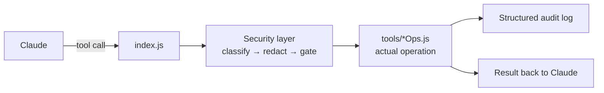

# Architecture

## Overview

Causly Server is an [MCP](https://modelcontextprotocol.io) (Model Context Protocol) server — a
process that runs on your own machine and exposes a set of **tools** that an MCP client (Claude
Desktop, or any other MCP-compatible client) can call directly inside a conversation.

At a system level, it's a single Node.js process (`index.js`) that:

1. Starts an MCP server over stdio
2. Registers every tool, resource, and prompt
3. Routes each incoming tool call through a **security layer** before it touches your filesystem,
   a database, a cloud API, or anything else
4. Executes the actual operation
5. Writes a structured, redacted line to `logs/activity.log`
6. Returns the result to the client



## Code organization

Every external service gets its own file under `tools/`, following the same shape:

```js
// tools/exampleOps.js
export async function exampleAction({ param1, param2 }) {
  // ... call the service's API or CLI
  return { result: "..." };
}
```

`index.js` imports each module and registers its functions as MCP tools with
`server.registerTool(name, { description, inputSchema }, wrap(name, fn))`. The `wrap()` helper is
where the security layer actually attaches — every registered tool passes through it, so no tool
can accidentally skip classification or logging.

This keeps each service's logic self-contained and independently testable, and means adding a new
service never requires touching another service's code.

## MCP primitives this server uses

MCP defines three kinds of things a server can expose. Causly Server uses all three:

### Tools

The bulk of the surface — 181 callable functions, one per action (`git_commit`,
`docker_build`, `notion_create_page`, and so on). Each has a name, a description, and a
Zod-validated input schema. This is what most of this documentation covers.

### Resources

Read-only, URI-addressable context that a client can fetch directly without an explicit tool
call — useful for grounding a conversation without spending a full tool-call round trip:

- `causly://project/{path}/health` — git cleanliness, dependency status, quick health snapshot
- `causly://project/{path}/info` — detected language, framework, package manager
- `causly://project/{path}/git` — current branch, ahead/behind, uncommitted changes

### Prompts

Pre-written, parameterized conversation starters that guide Claude through a known-good sequence
for a common task, rather than relying on Claude to reconstruct the right steps each time:

- **`ship-feature`** — walks through `ship_change`: verify → branch → commit → push → PR
- **`fix-ci`** — walks through `fix_ci` + `verify_ci_fix`: diagnose a failing run, fix it, confirm green
- **`deploy-project`** — walks through `deploy_project`: health check → tests/build → deploy → verify
- **`review-changes`** — a guided review checklist before shipping

## The security layer

Every tool call is genuinely capable of changing your filesystem, your infrastructure, or your
production systems — so nothing runs unexamined. Before (and around) every call,
`tools/security.js` classifies its risk level, gates `HIGH`/`DESTRUCTIVE` calls behind explicit
confirmation, redacts secrets before anything is logged, scans commands and paths for risk, and
appends a structured entry to `logs/activity.log`.

The full permission table, the approval-gate behavior, redaction, command/path risk scanning, the
audit-log format, and the optional BoundaryAttest evidence layer are documented on the dedicated
[Security](./security) page.

## Where to go next

- [Tool categories overview](./tools/overview) — every service this server talks to
- [Security](./security) — the detailed security and audit model
- [CONTRIBUTING.md](https://github.com/KNIHAL/causly-server/blob/main/CONTRIBUTING.md) — how to
  add a new tool module
- [BUILD_LOG.md](https://github.com/KNIHAL/causly-server/blob/main/BUILD_LOG.md) — the full
  history of what was built, in what order, and the bugs found along the way
