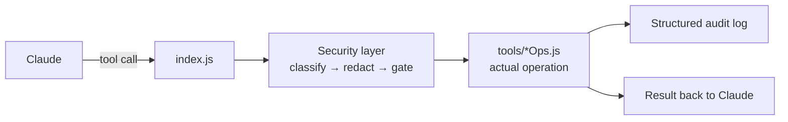

# Architecture

## Overview

Causly Server is an [MCP](https://modelcontextprotocol.io) (Model Context Protocol) server — a
process that runs on your own machine and exposes a set of **tools** that an MCP client (Claude
Desktop, or any other MCP-compatible client) can call directly inside a conversation.

At a system level, it's a single Node.js process (`index.js`) that:

1. Starts an MCP server over stdio
2. Registers every tool, resource, and prompt
3. Routes each incoming tool call through a **security layer** before it touches your filesystem,
   a database, a cloud API, or anything else
4. Executes the actual operation
5. Writes a structured, redacted line to `logs/activity.log`
6. Returns the result to the client



## Code organization

Every external service gets its own file under `tools/`, following the same shape:

```js
// tools/exampleOps.js
export async function exampleAction({ param1, param2 }) {
  // ... call the service's API or CLI
  return { result: "..." };
}
```

`index.js` imports each module and registers its functions as MCP tools with
`server.registerTool(name, { description, inputSchema }, wrap(name, fn))`. The `wrap()` helper is
where the security layer actually attaches — every registered tool passes through it, so no tool
can accidentally skip classification or logging.

This keeps each service's logic self-contained and independently testable, and means adding a new
service never requires touching another service's code.

## MCP primitives this server uses

MCP defines three kinds of things a server can expose. Causly Server uses all three:

### Tools

The bulk of the surface — 181 callable functions, one per action (`git_commit`,
`docker_build`, `notion_create_page`, and so on). Each has a name, a description, and a
Zod-validated input schema. This is what most of this documentation covers.

### Resources

Read-only, URI-addressable context that a client can fetch directly without an explicit tool
call — useful for grounding a conversation without spending a full tool-call round trip:

- `causly://project/{path}/health` — git cleanliness, dependency status, quick health snapshot
- `causly://project/{path}/info` — detected language, framework, package manager
- `causly://project/{path}/git` — current branch, ahead/behind, uncommitted changes

### Prompts

Pre-written, parameterized conversation starters that guide Claude through a known-good sequence
for a common task, rather than relying on Claude to reconstruct the right steps each time:

- **`ship-feature`** — walks through `ship_change`: verify → branch → commit → push → PR
- **`fix-ci`** — walks through `fix_ci` + `verify_ci_fix`: diagnose a failing run, fix it, confirm green
- **`deploy-project`** — walks through `deploy_project`: health check → tests/build → deploy → verify
- **`review-changes`** — a guided review checklist before shipping

## The security layer

Every tool call is genuinely capable of changing your filesystem, your infrastructure, or your
production systems — so nothing runs unexamined. Four things happen before (and around) every
call, implemented in `tools/security.js`:

### 1. Permission classification

Every registered tool carries a fixed risk level:

| Level | Meaning | Example |
|---|---|---|
| `READ` | Reads data, changes nothing | `git_status`, `docker_ps`, `sentry_list_issues` |
| `LOW` | Small, easily reversible changes | `git_add`, `notion_get_comments` |
| `MEDIUM` | Meaningful but recoverable changes | `git_commit`, `ship_change` |
| `HIGH` | Real-world side effects, needs explicit confirmation | `docker_build`, `deploy_project`, `slack_send_message` |
| `DESTRUCTIVE` | Hard or impossible to undo, needs explicit confirmation | `terraform_destroy`, `docker_rm`, `secrets_delete` |

### 2. The approval gate

Any `HIGH` or `DESTRUCTIVE` tool is rejected unless the caller passes `confirm: true` in its
input. This means Claude has to explicitly decide "yes, actually do this" — it can't be
accidentally triggered by a model just following a chain of reasoning.

### 3. Secret redaction

Before anything is written to `logs/activity.log`, every input is scanned and known-sensitive
fields (tokens, passwords, keys, connection strings, anything matching common credential
patterns) are replaced with a redacted placeholder — regardless of which tool or field they
appear in.

### 4. Command and path risk scanning

- `run_command` inputs are scanned for genuinely destructive patterns (drive wipes, `format`,
  `shutdown`) which are hard-blocked outright, and for elevated-risk-but-sometimes-legitimate
  patterns (force-push, `DROP TABLE`, `curl | bash`, `sudo`) which are flagged in the audit log
  rather than silently allowed.
- File and directory tools reject any target path that resolves inside a protected system
  directory (e.g. `C:\Windows`, `/etc`), regardless of how the path was constructed.

### Structured audit log

Every tool call — regardless of outcome — appends one JSON object to `logs/activity.log`:

```json
{"timestamp":"2026-09-02T11:29:08Z","operation_id":"a1b2c3","tool":"docker_build","risk":"HIGH","status":"ok","duration_ms":4210,"input":{"context_dir":"...","tag":"...","confirm":true}}
```

This is what makes the server auditable after the fact — not just "trust the model," but a real
trail of what ran, when, at what risk level, and how long it took.

## Where to go next

- [Tool categories overview](./tools/overview) — every service this server talks to
- [CONTRIBUTING.md](https://github.com/KNIHAL/causly-server/blob/main/CONTRIBUTING.md) — how to
  add a new tool module
- [BUILD_LOG.md](https://github.com/KNIHAL/causly-server/blob/main/BUILD_LOG.md) — the full
  history of what was built, in what order, and the bugs found along the way
